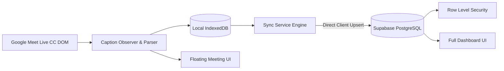

# 🎙️ Meet Transcript Saver

**Meet Transcript Saver** is a lightweight, privacy-focused Chrome Extension (Manifest V3) that automatically captures live closed captions (CC) from Google Meet sessions, stores them locally in IndexedDB, and batch-synchronizes the transcripts to Supabase PostgreSQL in real-time.

---

## ✨ Features

- ⚡ **Real-time Caption Extraction**: High-performance DOM observer built on structural heuristics—resilient to Google Meet UI class name changes and minification.
- 🎛️ **Floating In-Meeting Widget**: Interactive on-screen widget directly in Google Meet for real-time transcript preview, pause/resume, CC toggling, and recording controls.
- 📊 **Dedicated Full-Page Dashboard**: Search, filter, inspect, and export recorded meetings and transcript logs with ease.
- 🧹 **Clean Transcription & Bubble Merging**: Automatically aggregates speech continuations into coherent dialogue turns, filters UI noise and control icons (`arrow_downward`, `Jump to bottom`).
- 🗄️ **Local-First Storage (IndexedDB)**: Transcripts are saved locally first to guarantee zero data loss during network hiccups or tab closure.
- 🔄 **Direct Supabase Sync**: Batch uploads entries (20 items/batch or every 3 seconds) with exponential backoff retry.
- 🛡️ **Extension Context Resilience**: Built-in context validation prevents dangling timers and `Extension context invalidated` errors when reloading or updating the extension.
- 🔒 **Row-Level Security (RLS)**: Enforces per-user data isolation—users can only read and write their own meeting transcripts.
- 🔑 **Google OAuth via Supabase**: Seamless one-click authentication using `chrome.identity.launchWebAuthFlow`.

---

## 🏗️ Architecture



---

## 📁 Project Structure

```
meet-transcript-saver/
├── entrypoints/
│   ├── background.ts         # Service worker & lifecycle management
│   ├── content.ts            # Content script injected into meet.google.com
│   ├── content/              # Floating Widget UI (React + Tailwind Shadow DOM)
│   ├── dashboard/            # Full-page Dashboard UI (Search, Filter, Export)
│   └── popup/                # Extension Popup UI (Quick Controls & Stats)
├── lib/
│   ├── auth/                 # Google OAuth via chrome.identity & Supabase
│   ├── storage/              # IndexedDB local storage layer
│   ├── supabase/             # Supabase singleton client with safe chrome.storage adapter
│   ├── sync/                 # Sync engine with batching & backoff retry
│   └── transcript/           # Structural DOM parser & CC heuristics
├── supabase/
│   └── migrations/           # PostgreSQL schema, indexes, RLS policies
├── types/                    # Database & environment TypeScript definitions
├── docs/                     # Detailed setup and requirements documentation
├── wxt.config.ts             # WXT framework configuration & MV3 manifest
└── tsconfig.json             # TypeScript configuration
```

---

## 🚀 Getting Started

### 1. Prerequisites

- **Node.js** >= 18.x
- **pnpm** >= 9.x
- **Supabase CLI** (optional, for migrations)

### 2. Installation

Clone the repository and install dependencies:

```bash
git clone https://github.com/your-username/meet-transcript-saver.git
cd meet-transcript-saver
pnpm install
```

### 3. Environment Setup

Create a `.env.local` file in the root directory:

```env
VITE_SUPABASE_URL=https://your-project.supabase.co
VITE_SUPABASE_PUBLISHABLE_KEY=your-supabase-anon-key
```

### 4. Database Setup

Run the SQL migration located in `supabase/migrations/20260909173126_create_meetings_and_transcripts.sql` in your Supabase SQL Editor, or run:

```bash
supabase db push
```

Grant table access to the `authenticated` role:

```sql
GRANT ALL ON TABLE public.meetings TO authenticated;
GRANT ALL ON TABLE public.transcript_entries TO authenticated;
GRANT ALL ON ALL SEQUENCES IN SCHEMA public TO authenticated;
```

### 5. Google OAuth Configuration

1. In **Google Cloud Console**, create an OAuth 2.0 Web Client.
2. In **Supabase Dashboard → Authentication → URL Configuration**, add your extension redirect URI:
   ```
   https://<YOUR_EXTENSION_ID>.chromiumapp.org/
   ```
3. Enable Google Provider in **Supabase Dashboard → Authentication → Providers**.

---

## 🛠️ Development & Build

### Development Mode

```bash
pnpm dev
```

### Production Build

```bash
pnpm build
```

The output will be built into `.output/chrome-mv3`.

### Load into Chrome

1. Open Google Chrome and navigate to `chrome://extensions`.
2. Enable **Developer mode** in the top right corner.
3. Click **Load unpacked** and select the `.output/chrome-mv3` folder.

---

## 📖 Usage

1. Click the **Meet Transcript Saver** extension icon in Chrome and click **Sign in with Google**.
2. Join any Google Meet at [meet.google.com](https://meet.google.com).
3. The extension automatically detects the in-call state, activates Closed Captions (CC), and renders the **Floating Widget**.
4. Monitor live captions, pause/resume, or open the **Dashboard** directly from the floating widget or popup.
5. When the meeting ends or when you click **⏹ Stop Recording**, all transcripts are persisted locally and batch-synced to Supabase.

---

## 📄 License

MIT License © 2026
