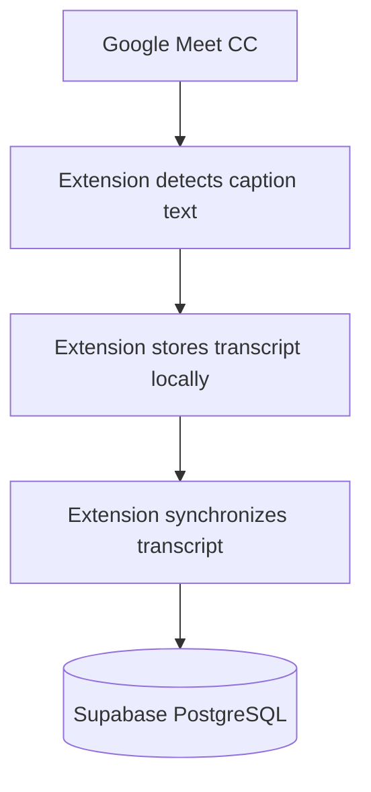
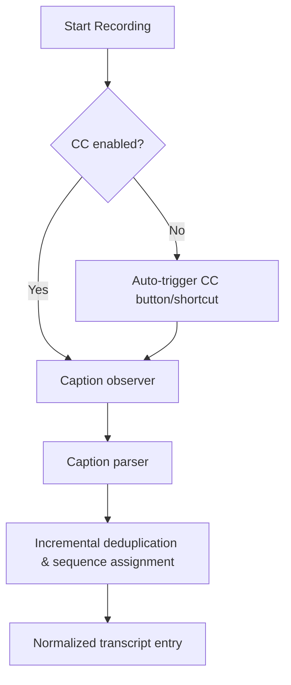
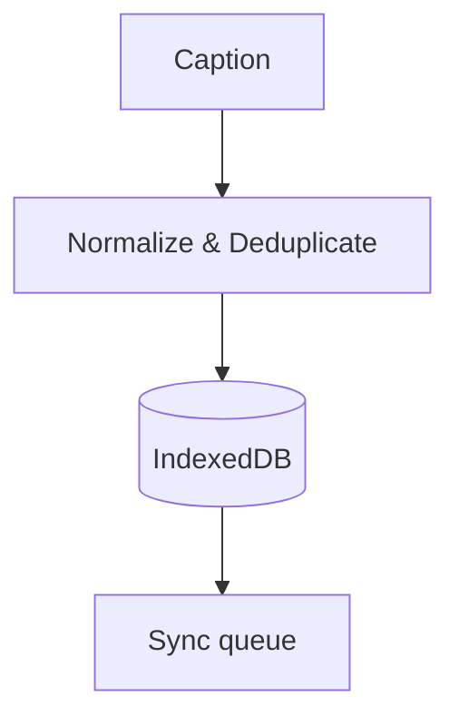
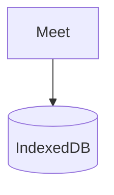
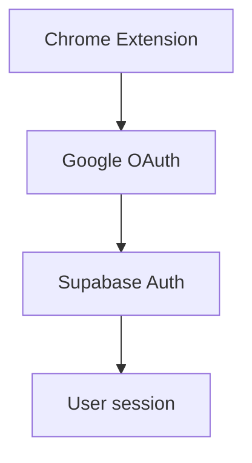
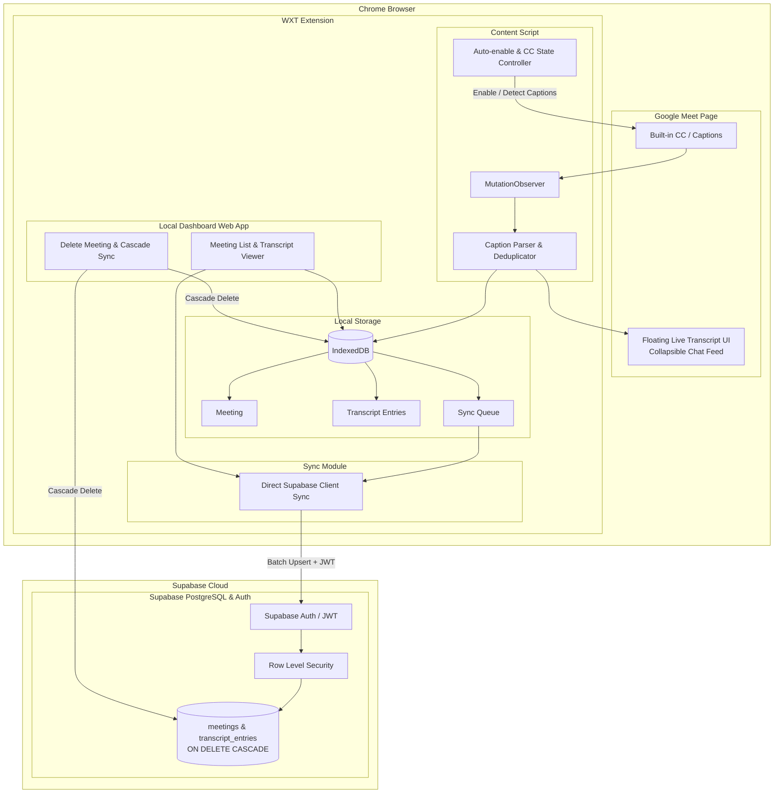

# Meet Transcript Saver — Requirements

## 1. Product

Build a Chrome Extension that captures the text already displayed by Google Meet's built-in CC/captions and stores the transcript in a user's database.

The application must NOT perform speech recognition.

---

## 2. Primary goal

When a user joins a Google Meet and enables built-in captions:



The final transcript should contain, when available:

- Speaker
- Text
- Timestamp
- Sequence/order

---

## 3. Explicit non-goals

The product must NOT:

- Record microphone audio.
- Record meeting audio.
- Record meeting video.
- Capture the screen.
- Perform speech-to-text.
- Use Whisper.
- Send audio to an external transcription API.
- Depend on a paid Google Workspace transcription feature.
- Depend on an external transcription SaaS.

The extension only reads the caption text that Google Meet has already rendered in the page.

---

## 4. Technology requirements

### Extension

Use:

- WXT
- React
- TypeScript
- Chrome Manifest V3

### Local storage

Use:

- IndexedDB

### Backend

Use:

- Supabase
- PostgreSQL
- Supabase Auth
- Supabase RLS
- Supabase migrations
- (Optional / Future: Supabase Edge Functions)

### Authentication

Use:

- Google OAuth
- Supabase Auth

### Do not use unless a future requirement explicitly justifies it

- Next.js for the extension
- Prisma
- Express
- Fastify
- AWS RDS
- AWS EC2
- Redis
- OpenAI transcription
- Whisper
- audio capture

---

## 5. Google Meet caption extraction & Auto-enable CC

The extension must read Google Meet's existing CC DOM.

Expected flow:



### Auto-enable CC
- When recording starts (either automatically or manually), the extension checks if Google Meet's built-in captions (CC) are currently active.
- If captions are not active, the extension automatically activates CC (e.g., querying the CC toggle button `button[aria-label*="caption" i]` / shortcut `c` or accessibility controls) so Google Meet begins rendering captions into the DOM.
- The user can still toggle captions manually, but starting recording guarantees captions are turned on.

Selectors must be isolated in one place so they can be updated if Google Meet changes its DOM.

### Speaker Normalization (Replacing "You" / "Bạn")
- When Google Meet captions display the generic self-pronoun "You" or "Bạn" (or equivalents in other languages) for the user speaking, the extension must automatically replace it with the authenticated user's actual display name (e.g. full name or email name) so transcripts have clear identity attribution.

### In-Call Only Recording Guard
- Recording must strictly occur **only when the user is inside an active meeting room** (`/abc-defg-hij`).
- It must **not** record on the home page (`meet.google.com`), landing page, green room / pre-join lobby (before clicking "Join now"), or after the call ends.
- The extension automatically detects when the user enters the meeting room from the lobby and auto-starts recording (if enabled), and automatically stops recording when leaving the call.

---

## 6. Caption observer & Incremental Resume

Use `MutationObserver` or an equivalent DOM observation mechanism.

The observer must detect:

- New captions
- Caption text updates
- Speaker changes
- Caption removal/rotation where relevant

### Incremental Recording & Resume from Previous Stop Point
- When recording is stopped/paused and subsequently restarted during an ongoing meeting (same meeting code/URL or session):
  - The extension must resume from the last recorded position (`last_sequence` watermark).
  - It must **not** start recording all visible DOM captions from sequence 0 again or duplicate past entries into IndexedDB/Supabase.
  - The parser maintains a watermark/hash of previously recorded entries so that resuming only appends new dialogue spoken after the resume point.

### User Pause & Disable Recording Control
- The user must be able to pause recording or temporarily disable the extension's recording activity at any time (via Floating Widget or Popup toggle).
- When paused/disabled:
  - The extension completely ceases caption observation and transcript saving.
  - No new data is synced to the database.
  - Auto-record on joining meetings is suppressed when the extension is disabled.
  - The UI clearly indicates the paused/disabled state with a 1-click option to resume/re-enable.

---

## 7. Transcript model

Conceptual model:

```ts
type TranscriptEntry = {
  sequence: number;
  speaker: string | null;
  text: string;
  startedAt: string;
};
```

`sequence` must be monotonically increasing within a meeting, even across pause/resume cycles.

---

## 8. Meeting model & Session Lifecycle

A meeting should contain:

```text
id
user_id
title
meet_url
started_at
ended_at
created_at
```

Requirements:

- Every meeting belongs to one authenticated user.
- A meeting can have many transcript entries.
- Ending or pausing a meeting must not delete its transcript.
- **Resume capability**: If a recording is resumed for an active or existing meeting in the same session, the existing `meeting_id` is retained and updated rather than spawning redundant duplicate meeting records.

---

## 9. Transcript database model & Cascade Deletion

Transcript entry:

```text
id
meeting_id (REFERENCES meetings(id) ON DELETE CASCADE)
sequence
speaker
text
started_at
created_at
```

Constraints:

```sql
UNIQUE(meeting_id, sequence)
FOREIGN KEY (meeting_id) REFERENCES meetings(id) ON DELETE CASCADE
```

- When a meeting is deleted, all associated `transcript_entries` must be automatically deleted (`ON DELETE CASCADE` at the PostgreSQL schema level, and cascading deletion in local IndexedDB).

---

## 10. RLS requirements

Row Level Security must be enabled.

Authenticated users:

- Can access their own meetings.
- Can create their own meetings.
- Can update/end their own meetings.
- Can delete their own meetings (triggering cascade deletion of transcripts).
- Can access transcript entries belonging to their own meetings.
- Cannot access another user's meetings.
- Cannot access another user's transcripts.

RLS must be enforced by PostgreSQL, not only by frontend logic.

---

## 11. Local-first requirement

Every transcript entry must be persisted locally before being considered safely captured.

Example:



If the network is unavailable:



must continue working.

When network connectivity returns, queued entries must be synchronized.

---

## 12. Sync requirements

Do not send an HTTP request for every caption mutation.

Use batch synchronization.

Suggested triggers:

- Every ~3 seconds
- Every ~20 entries
- Meeting end / pause

whichever happens first.

The exact values can be configurable.

---

## 13. Retry requirements

Failed synchronization must be retried.

Use exponential backoff with a reasonable maximum retry interval.

The extension must not lose locally stored transcript data when:

- Request fails
- Internet disconnects
- Supabase is temporarily unavailable
- Browser popup closes
- Background request fails

---

## 14. Idempotency

Sync must be safe to retry.

Example:

```text
meeting_id = A
sequence = 42
```

If the same entry is sent twice, the database must not create two records.

Use:

```text
UNIQUE(meeting_id, sequence)
```

and appropriate insert/upsert behavior.

---

## 15. Synchronization Architecture

### Primary: Direct Client Sync via Supabase RLS

The extension syncs batches of transcript entries directly to Supabase using `@supabase/supabase-js`.

Responsibilities:

1. Authenticate request via user session token.
2. PostgreSQL RLS verifies that `meetings.user_id = auth.uid()`.
3. PostgreSQL enforces `UNIQUE(meeting_id, sequence)` constraint on `.upsert()`.
4. Never expose privileged credentials (service-role key) to the extension.

### Optional / Future: Edge Function

If future requirements demand server-side secret handling (such as AI summarization or external webhooks), a dedicated Edge Function (`sync-transcript`) may be deployed.

---

## 16. Authentication

Authentication flow:



The extension must be able to determine the authenticated Supabase user.

Database records must use the authenticated user's ID.

---

## 17. Security

Never put these in the extension:

```text
SUPABASE_SERVICE_ROLE_KEY
DATABASE_PASSWORD
```

The extension may contain:

```text
SUPABASE_URL
SUPABASE_PUBLISHABLE_KEY
```

assuming the corresponding Supabase RLS/security configuration is correct.

All privileged server operations must happen inside Edge Functions.

---

## 18. Environment configuration

Development configuration should use environment variables.

Expected:

```text
VITE_SUPABASE_URL=
VITE_SUPABASE_PUBLISHABLE_KEY=
```

Do not commit `.env.local`.

Production secrets must be configured through the appropriate Supabase/hosting secret mechanism.

---

## 19. Migration requirements

All database schema changes must be represented by Supabase migrations.

Do not rely on manually created production tables that are not represented in Git.

Repository must contain:

```text
supabase/
└── migrations/
```

Migration history must be reproducible.

---

## 20. Type safety

TypeScript should be used throughout the extension.

Database types should be generated from Supabase:

```bash
supabase gen types typescript --linked
```

Avoid manually duplicating database types when generated types can be used.

---

## 21. Error handling

The extension must handle:

- Google Meet page changes
- CC disabled / Auto-enabling CC failure
- CC turned off by user during recording (gracefully pause/stop recording)
- CC unavailable
- Caption DOM not found
- Unknown speaker
- Empty caption
- Duplicate caption
- Network failure
- Authentication failure
- Supabase error
- Invalid sync payload
- Meeting paused and resumed
- Meeting ended unexpectedly

Errors should be logged in development but should not expose sensitive credentials or tokens.

---

## 22. Performance

The extension must have minimal impact on Google Meet.

Avoid:

- Polling the entire DOM continuously.
- Expensive DOM queries on every mutation.
- Sending a network request for every caption update.
- Keeping unnecessary large transcript data in memory.

Use targeted DOM observation and batching.

---

## 23. Privacy

The extension should only collect:

- Google Meet URL
- Meeting metadata required by the product
- Caption text
- Speaker name when available
- Timestamp/sequence
- Authenticated user identifier

No audio or video should be collected.

The product should clearly communicate that transcript text from captions is stored in the user's Supabase database.

---

## 24. User Interfaces

The product includes three main UI surfaces:

### 1. In-Call Floating Transcript Widget (Tactiq-style)
- **Overlay injected directly into Google Meet** (`content script` / shadow DOM UI).
- **Conversation Feed**: Displays live dialogue ordered chronologically as a conversation stream with speaker avatar/initial, speaker name, timestamp, and message text.
- **Collapsible / Expandable**: Can collapse to a compact floating pill/badge or expand into a full conversation view sidebar/panel.
- **In-Call Controls**: Start / Pause / Resume / Stop recording, Master disable toggle, real-time sync status (e.g. entry count, synced badge).
- **Scroll & Review**: Allows scrolling up during the call to review earlier speech segments in the meeting.

### 2. Extension Popup
- Authentication status (Sign in / Sign out).
- Current meeting status & quick toggle controls (Start / Pause / Disable recording).
- Quick link to open the Local Management Dashboard.

### 3. Local Management Dashboard Webpage (Extension Web App)
- Local page packaged in the extension (`chrome-extension://<id>/dashboard.html` or WXT HTML entrypoint).
- **Meeting List**: Displays all recorded meetings with date, meeting title, URL, duration, and total transcript count.
- **Transcript Viewer**: Full dialogue view for any selected meeting with search/filter and export capabilities.
- **Meeting Management & Deletion**: Allows selecting individual or batch meetings and deleting them. Deleting a meeting triggers cascading deletion of all associated transcripts (`ON DELETE CASCADE` in Supabase & local IndexedDB).

---

## 25. Acceptance criteria

The project is considered complete when:

### Authentication
- User can sign in with Google.
- User session persists appropriately.
- User can sign out.

### Meeting & Auto CC
- Extension detects a Google Meet page.
- Starting recording automatically enables Google Meet CC captions if not already enabled.
- Turning off CC in Google Meet during recording automatically pauses/stops recording.
- User can explicitly pause / disable recording via popup or floating widget at any time.
- Resuming a recording in the same meeting continues from the last recorded point without re-recording or duplicating prior text.

### Live Floating UI
- Floating widget appears inside Google Meet page.
- Shows live transcripts ordered sequentially in chat conversation format.
- Collapsible into compact floating pill and expandable into full view.

### Local Management Dashboard
- Local dashboard accessible via extension (`chrome-extension://...`).
- Shows history of all recorded meetings and allows reading transcripts.
- Allows deleting meetings with automatic cascade deletion of corresponding transcripts in both Supabase and IndexedDB.

### Local Persistence & Sync
- Transcript survives temporary network failures via IndexedDB.
- Transcript syncs reliably to Supabase in batches with deduplication and retry mechanism.
- Database enforces `ON DELETE CASCADE` and `UNIQUE(meeting_id, sequence)`.

### Reliability
- Failed requests retry with exponential backoff.
- Extension handles missing/unexpected caption DOM gracefully.
- Errors are visible in development logs.

### Security
- No service-role key exists in extension code.
- No database password exists in extension code.
- `.env.local` is not committed.
- RLS is enabled and tested to isolate user data.

---

## 26. Implementation constraint

Before implementation begins, the developer/AI must inspect the actual Google Meet caption DOM in the current version of Google Meet.

Do not invent:

- CSS selectors
- DOM structure
- speaker selectors
- caption selectors

If the DOM structure changes, caption extraction logic must be isolated so it can be updated without rewriting the rest of the application.

---

## 27. Recommended implementation architecture



