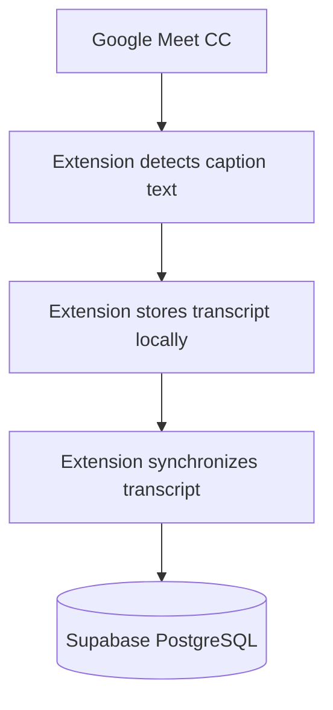
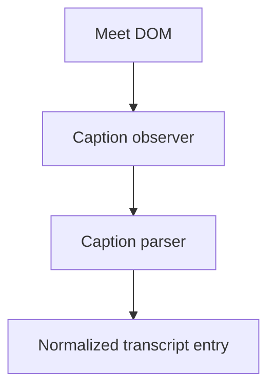
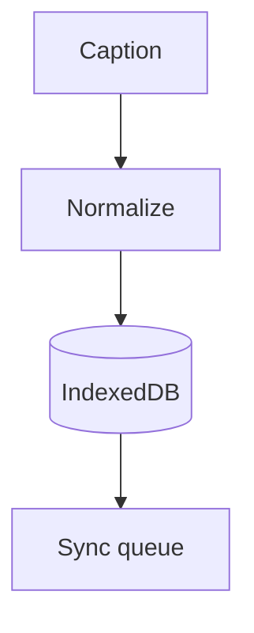
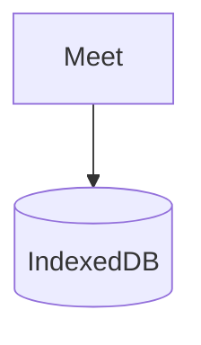
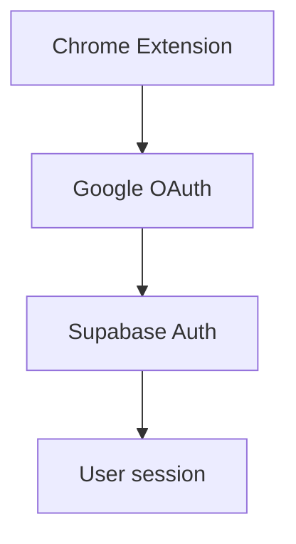
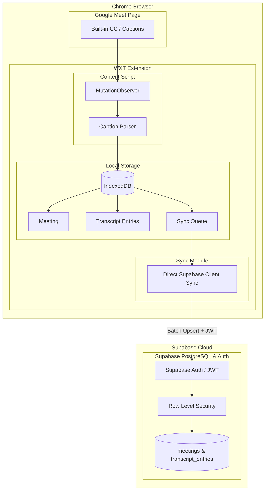

# Meet Transcript Saver — Requirements

## 1. Product

Build a Chrome Extension that captures the text already displayed by Google Meet's built-in CC/captions and stores the transcript in a user's database.

The application must NOT perform speech recognition.

---

## 2. Primary goal

When a user joins a Google Meet and enables built-in captions:



The final transcript should contain, when available:

- Speaker
- Text
- Timestamp
- Sequence/order

---

## 3. Explicit non-goals

The product must NOT:

- Record microphone audio.
- Record meeting audio.
- Record meeting video.
- Capture the screen.
- Perform speech-to-text.
- Use Whisper.
- Send audio to an external transcription API.
- Depend on a paid Google Workspace transcription feature.
- Depend on an external transcription SaaS.

The extension only reads the caption text that Google Meet has already rendered in the page.

---

## 4. Technology requirements

### Extension

Use:

- WXT
- React
- TypeScript
- Chrome Manifest V3

### Local storage

Use:

- IndexedDB

### Backend

Use:

- Supabase
- PostgreSQL
- Supabase Auth
- Supabase RLS
- Supabase migrations
- (Optional / Future: Supabase Edge Functions)

### Authentication

Use:

- Google OAuth
- Supabase Auth

### Do not use unless a future requirement explicitly justifies it

- Next.js for the extension
- Prisma
- Express
- Fastify
- AWS RDS
- AWS EC2
- Redis
- OpenAI transcription
- Whisper
- audio capture

---

## 5. Google Meet caption extraction

The extension must read Google Meet's existing CC DOM.

Expected flow:



The implementation must NOT assume that a selector found in an old article or GitHub project is still valid.

Selectors must be isolated in one place so they can be updated if Google Meet changes its DOM.

---

## 6. Caption observer

Use `MutationObserver` or an equivalent DOM observation mechanism.

The observer must detect:

- New captions
- Caption text updates
- Speaker changes
- Caption removal/rotation where relevant

The parser must avoid storing the same caption repeatedly.

---

## 7. Transcript model

Conceptual model:

```ts
type TranscriptEntry = {
  sequence: number;
  speaker: string | null;
  text: string;
  startedAt: string;
};
```

`sequence` must be monotonically increasing within a meeting.

---

## 8. Meeting model

A meeting should contain:

```text
id
user_id
title
meet_url
started_at
ended_at
created_at
```

Requirements:

- Every meeting belongs to one authenticated user.
- A meeting can have many transcript entries.
- Ending a meeting must not delete its transcript.

---

## 9. Transcript database model

Transcript entry:

```text
id
meeting_id
sequence
speaker
text
started_at
created_at
```

Constraint:

```text
UNIQUE(meeting_id, sequence)
```

This is required for idempotent synchronization.

---

## 10. RLS requirements

Row Level Security must be enabled.

Authenticated users:

- Can access their own meetings.
- Can create their own meetings.
- Can update/end their own meetings.
- Can access transcript entries belonging to their own meetings.
- Cannot access another user's meetings.
- Cannot access another user's transcripts.

RLS must be enforced by PostgreSQL, not only by frontend logic.

---

## 11. Local-first requirement

Every transcript entry must be persisted locally before being considered safely captured.

Example:



If the network is unavailable:



must continue working.

When network connectivity returns, queued entries must be synchronized.

---

## 12. Sync requirements

Do not send an HTTP request for every caption mutation.

Use batch synchronization.

Suggested triggers:

- Every ~3 seconds
- Every ~20 entries
- Meeting end

whichever happens first.

The exact values can be configurable.

---

## 13. Retry requirements

Failed synchronization must be retried.

Use exponential backoff with a reasonable maximum retry interval.

The extension must not lose locally stored transcript data when:

- Request fails
- Internet disconnects
- Supabase is temporarily unavailable
- Browser popup closes
- Background request fails

---

## 14. Idempotency

Sync must be safe to retry.

Example:

```text
meeting_id = A
sequence = 42
```

If the same entry is sent twice, the database must not create two records.

Use:

```text
UNIQUE(meeting_id, sequence)
```

and appropriate insert/upsert behavior.

---

## 15. Synchronization Architecture

### Primary: Direct Client Sync via Supabase RLS

The extension syncs batches of transcript entries directly to Supabase using `@supabase/supabase-js`.

Responsibilities:

1. Authenticate request via user session token.
2. PostgreSQL RLS verifies that `meetings.user_id = auth.uid()`.
3. PostgreSQL enforces `UNIQUE(meeting_id, sequence)` constraint on `.upsert()`.
4. Never expose privileged credentials (service-role key) to the extension.

### Optional / Future: Edge Function

If future requirements demand server-side secret handling (such as AI summarization or external webhooks), a dedicated Edge Function (`sync-transcript`) may be deployed.

---

## 16. Authentication

Authentication flow:



The extension must be able to determine the authenticated Supabase user.

Database records must use the authenticated user's ID.

---

## 17. Security

Never put these in the extension:

```text
SUPABASE_SERVICE_ROLE_KEY
DATABASE_PASSWORD
```

The extension may contain:

```text
SUPABASE_URL
SUPABASE_PUBLISHABLE_KEY
```

assuming the corresponding Supabase RLS/security configuration is correct.

All privileged server operations must happen inside Edge Functions.

---

## 18. Environment configuration

Development configuration should use environment variables.

Expected:

```text
VITE_SUPABASE_URL=
VITE_SUPABASE_PUBLISHABLE_KEY=
```

Do not commit `.env.local`.

Production secrets must be configured through the appropriate Supabase/hosting secret mechanism.

---

## 19. Migration requirements

All database schema changes must be represented by Supabase migrations.

Do not rely on manually created production tables that are not represented in Git.

Repository must contain:

```text
supabase/
└── migrations/
```

Migration history must be reproducible.

---

## 20. Type safety

TypeScript should be used throughout the extension.

Database types should be generated from Supabase:

```bash
supabase gen types typescript --linked
```

Avoid manually duplicating database types when generated types can be used.

---

## 21. Error handling

The extension must handle:

- Google Meet page changes
- CC disabled
- CC unavailable
- Caption DOM not found
- Unknown speaker
- Empty caption
- Duplicate caption
- Network failure
- Authentication failure
- Supabase error
- Invalid sync payload
- Meeting ended unexpectedly

Errors should be logged in development but should not expose sensitive credentials or tokens.

---

## 22. Performance

The extension must have minimal impact on Google Meet.

Avoid:

- Polling the entire DOM continuously.
- Expensive DOM queries on every mutation.
- Sending a network request for every caption update.
- Keeping unnecessary large transcript data in memory.

Use targeted DOM observation and batching.

---

## 23. Privacy

The extension should only collect:

- Google Meet URL
- Meeting metadata required by the product
- Caption text
- Speaker name when available
- Timestamp/sequence
- Authenticated user identifier

No audio or video should be collected.

The product should clearly communicate that transcript text from captions is stored in the user's Supabase database.

---

## 24. Future UI

The initial implementation may provide:

- Login/logout
- Current meeting status
- Recording/transcript status
- Sync status
- Transcript preview
- Meeting history

A future web dashboard may be implemented separately.

The extension itself remains WXT + React.

---

## 25. Acceptance criteria

The project is considered complete when:

### Authentication

- User can sign in with Google.
- User session persists appropriately.
- User can sign out.

### Meeting

- Extension detects a Google Meet page.
- User can start/track a meeting transcript.
- Meeting metadata is stored.

### Caption extraction

- Built-in Google Meet CC text is detected.
- Speaker is captured when available.
- Caption updates do not create excessive duplicates.
- Transcript order is preserved.

### Local persistence

- Transcript survives temporary network failures.
- Transcript remains queued until successfully synchronized.

### Backend

- Transcript is stored in Supabase PostgreSQL.
- RLS prevents cross-user access.
- RLS validates authentication and meeting ownership.
- Repeated sync requests do not create duplicates.

### Reliability

- Failed requests retry.
- Extension handles missing/unexpected caption DOM gracefully.
- Errors are visible in development logs.

### Security

- No service-role key exists in extension code.
- No database password exists in extension code.
- `.env.local` is not committed.
- RLS is enabled and tested.

---

## 26. Implementation constraint

Before implementation begins, the developer/AI must inspect the actual Google Meet caption DOM in the current version of Google Meet.

Do not invent:

- CSS selectors
- DOM structure
- speaker selectors
- caption selectors

If the DOM structure changes, caption extraction logic must be isolated so it can be updated without rewriting the rest of the application.

---

## 27. Recommended implementation architecture


