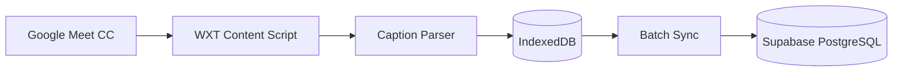
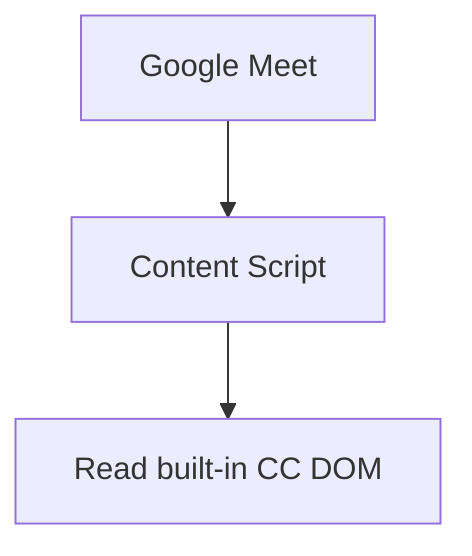
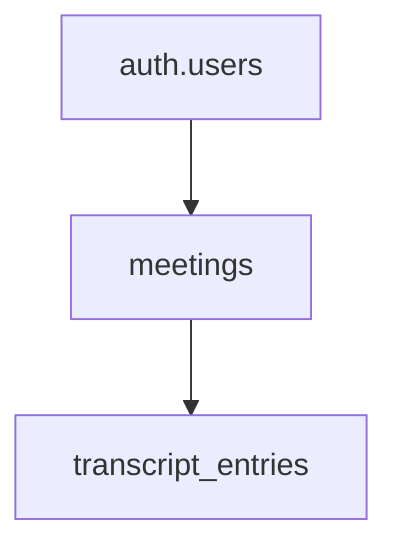
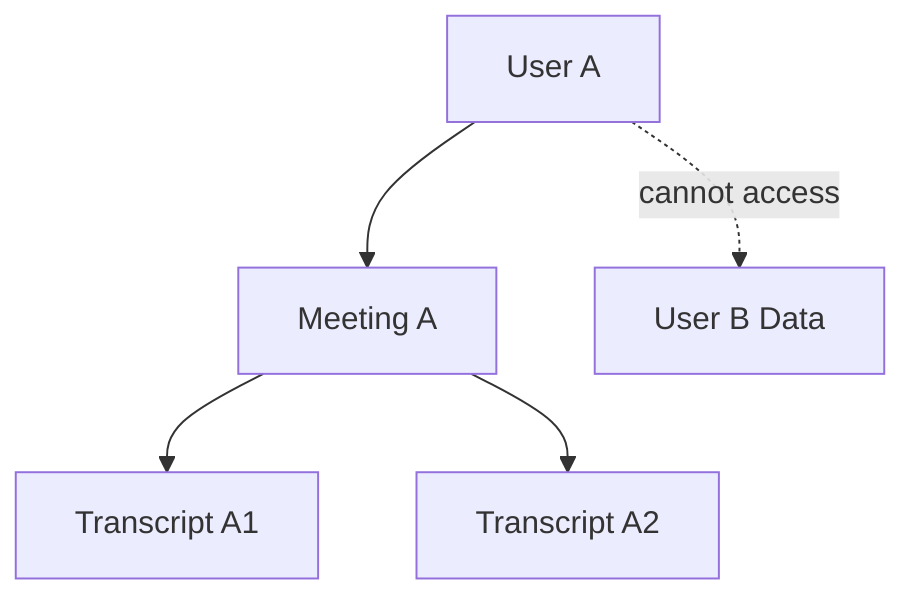
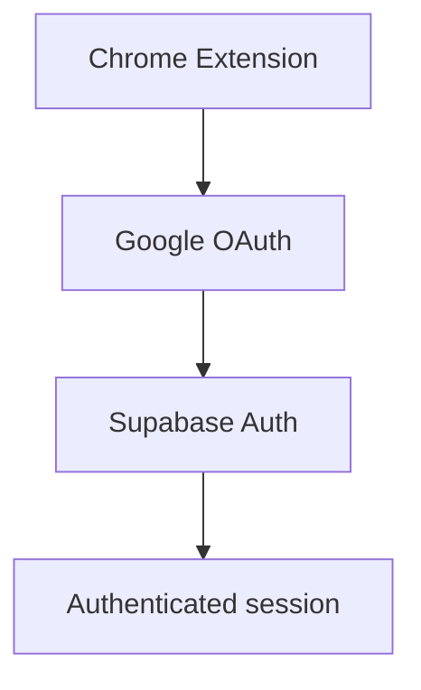
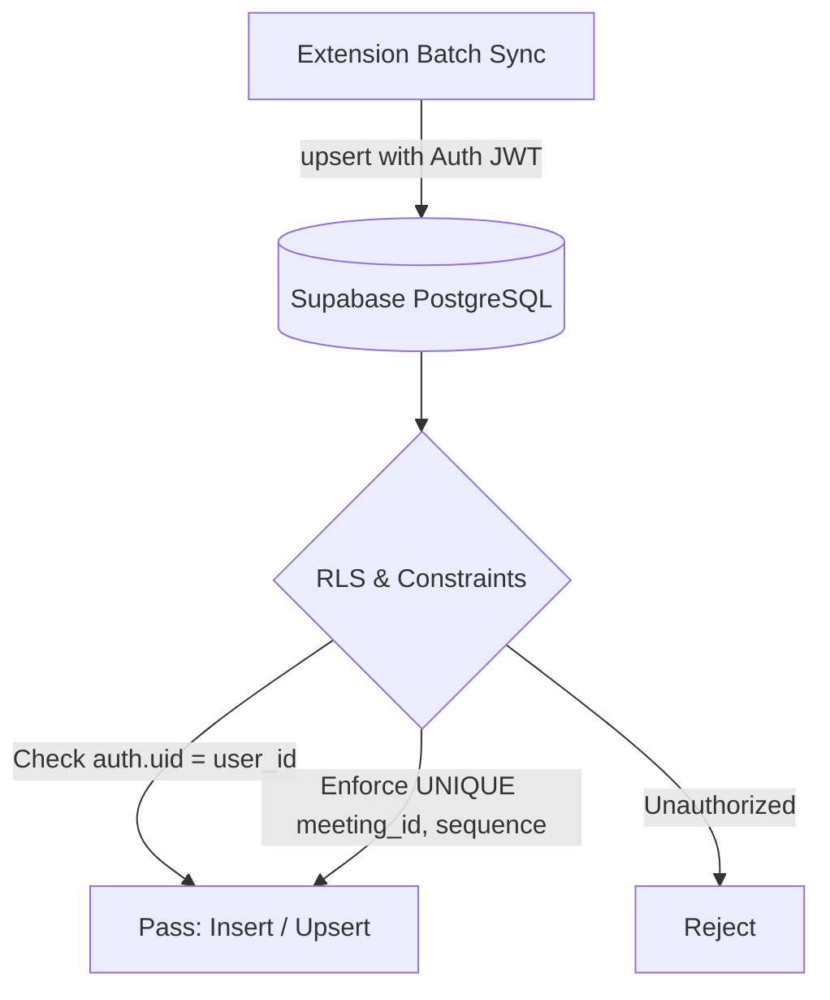
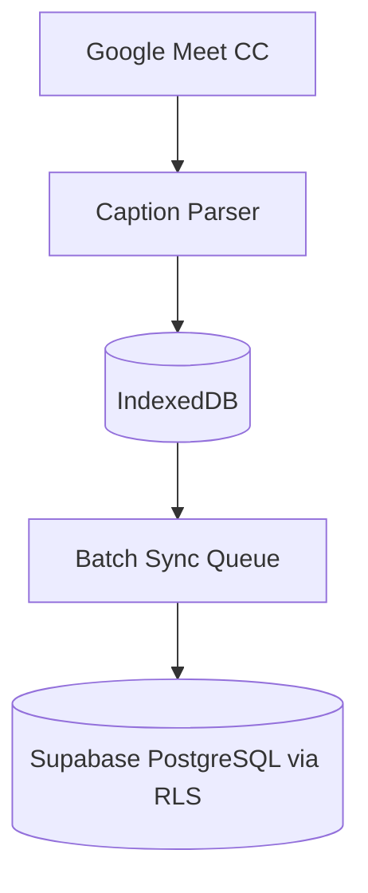
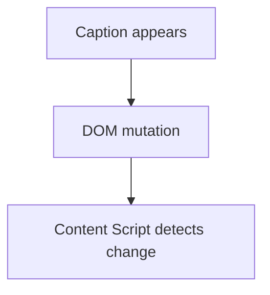

# Meet Transcript Saver — Setup Guide

## 1. Project overview

A Chrome Extension that uses Google Meet built-in CC/captions to extract transcript text and save it to a database.

Core architecture:



Do not use:

- Audio recording
- Video recording
- Speech-to-text
- Whisper
- OpenAI transcription
- Google Meet paid transcription API

---

## 2. Prerequisites

Install:

- Node.js 24 LTS
- pnpm
- Git
- Google Chrome
- VS Code or other IDEs
- Supabase CLI

Verify:

```bash
node -v
pnpm -v
git --version
supabase --version
```

---

## 3. Create WXT project

Create project:

```bash
pnpm dlx wxt@latest init
```

Select:

```text
Project name: meet-transcript-saver
Template: React
```

Then:

```bash
cd meet-transcript-saver
pnpm install
pnpm dev
```

WXT is used as the primary framework for the Chrome Extension.

Stack:

- WXT
- React
- TypeScript
- Manifest V3

Do not use Next.js for the extension.

---

## 4. Git repository

```bash
git init
git add .
git commit -m "chore: initialize WXT extension"
```

Create GitHub repository:

```text
meet-transcript-saver
```

Then push the project.

---

## 5. Chrome Extension configuration

The extension needs to run on:

```text
https://meet.google.com/*
```

The content script will be used to read the Google Meet DOM.

Goal:



Do not use audio/screen capture.

Do not hard-code Google Meet selectors before inspecting the actual DOM.

---

## 6. Create Supabase project

Create a Supabase project:

```text
Project name:
meet-transcript-saver

Region:
Singapore
```

During project creation:

```text
Enable Data API: ON
Automatically expose new tables: OFF
Enable automatic RLS: ON
```

### Credentials

Save the following:

```text
Project URL
Project Ref
Publishable key
Database password
```

Do not commit credentials to Git.

Specifically:

```text
SERVICE_ROLE_KEY
DATABASE_PASSWORD
```

must not be included in the Chrome Extension.

---

## 7. Supabase CLI

In the project directory:

```bash
supabase init
```

Login:

```bash
supabase login
```

Link project:

```bash
supabase link --project-ref <PROJECT_REF>
```

Verify:

```bash
supabase status
```

It is not required to run Supabase locally/via Docker in the initial phase.

You can use:

```text
WXT local
+
Supabase Cloud
+
Supabase CLI migrations
```

---

## 8. Database migrations

Database schema must be managed via migrations and committed to Git.

Create migration:

```bash
supabase migration new create_meetings_and_transcripts
```

The first migration needs to create:

### meetings

Fields:

```text
id
user_id
title
meet_url
started_at
ended_at
created_at
```

### transcript_entries

Fields:

```text
id
meeting_id
sequence
speaker
text
started_at
created_at
```

Constraint:

```text
UNIQUE(meeting_id, sequence)
```

Relationship:



RLS must be enabled and policies must restrict data to the authenticated user.

Do not create production schema directly using the Dashboard SQL Editor if the change needs to be version-controlled.

Apply migration:

```bash
supabase db push
```

---

## 9. Database security

Expected security model:



RLS must ensure:

- User can only read their own meetings.
- User can only create meetings for themselves.
- User can only update/end their own meetings.
- User can only read transcripts belonging to their own meetings.
- User cannot read data from other users.

Policies must be placed in migrations.

---

## 10. Generate TypeScript database types

After the schema is stable:

```bash
supabase gen types typescript --linked > types/database.ts
```

Database types should be committed to Git if the project wants to keep generated types in the repository.

---

## 11. Supabase client

Install:

```bash
pnpm add @supabase/supabase-js
```

Environment variables:

```text
VITE_SUPABASE_URL=
VITE_SUPABASE_PUBLISHABLE_KEY=
```

`.env.local` must be in `.gitignore`.

Do not use the service-role key in the extension.

---

## 12. Google OAuth

Authentication flow:



### Google Cloud

Create:

```text
Google Cloud Project
OAuth consent screen
OAuth Client
```

### Supabase

Enable:

```text
Authentication
→ Providers
→ Google
```

Chrome Extension ID must be determined before completing the OAuth redirect configuration.

Do not guess the redirect URL; use the current format in the Supabase documentation for Chrome Extensions.

---

## 13. Get Extension ID

1. Generate the extension build files in `.output/chrome-mv3` by running:

```bash
pnpm dev
# or
pnpm build
```

2. Open Chrome and navigate to:

```text
chrome://extensions
```

3. Enable **Developer mode** (toggle at the top right).

4. Click **Load unpacked** and select the build directory:

```text
meet-transcript-saver/.output/chrome-mv3
```

5. Copy the **Extension ID** displayed on the card.

The Extension ID is used for Google OAuth and Supabase Auth configuration.

---

## 14. Transcript sync mechanism

### Primary: Direct Supabase Client Sync (Current Phase)

In the current phase, sync is performed directly from the extension to Supabase PostgreSQL using `@supabase/supabase-js` and **Row Level Security (RLS)**.



- **Authentication**: Validated automatically via the user's Supabase session JWT.
- **Ownership**: PostgreSQL RLS policies enforce that users can only insert transcripts into meetings they own (`meetings.user_id = auth.uid()`).
- **Idempotency**: Handled by PostgreSQL constraint `UNIQUE(meeting_id, sequence)` with `.upsert(..., { onConflict: 'meeting_id,sequence' })`.

### Future / Optional: Supabase Edge Function

Edge Functions (running on Deno) can be added later if advanced server-side processing is required (e.g., AI transcript summarization, webhook triggers, or third-party secret integration):

```bash
# Optional for future phases:
supabase functions new sync-transcript
supabase functions deploy sync-transcript
```

---

## 15. Local transcript storage

Transcripts must be saved locally before syncing.

Architecture:



Reasons:

- Network connection might be lost.
- Meet might disconnect.
- User might close the popup.
- Transcript must not be lost just because an API request failed.

IndexedDB is expected to store:

```text
meetings
transcript_entries
sync_queue
```

Sync should implement retry and idempotency.

---

## 16. Transcript sync

Do not send every caption character/request to the server.

Use batching:

```text
20 entries
OR
~3 seconds
OR
meeting ended
```

whichever comes first.

The server must support idempotent inserts.

Database constraint:

```text
UNIQUE(meeting_id, sequence)
```

helps avoid duplicates on retry.

---

## 17. Google Meet CC investigation

This part requires manual inspection.

Join a test Google Meet.

Enable:

```text
CC / Captions
```

Open Chrome DevTools.

Find the DOM elements containing:

```text
Speaker
Caption text
```

Do not assume fixed selectors.

Google Meet DOM structure can change.

Need to identify:

```text
Caption container
Speaker element
Text element
Caption update behavior
Caption creation/removal behavior
```

---

## 18. MutationObserver test

In the DevTools Console of Google Meet:

```js
const observer = new MutationObserver((mutations) => {
  console.log(mutations);
});

observer.observe(document.body, {
  subtree: true,
  childList: true,
  characterData: true,
});
```

Speak in the meeting and observe the mutations.

Goal:



---

## 19. Final project architecture

Expected structure:

```text
meet-transcript-saver/
│
├── entrypoints/
│   ├── background.ts
│   ├── content.ts
│   └── popup/
│
├── components/
│
├── lib/
│   ├── supabase/
│   ├── transcript/
│   ├── storage/
│   └── sync/
│
├── types/
│   └── database.ts
│
├── public/
│
├── supabase/
│   ├── migrations/
│   └── functions/
│       └── sync-transcript/
│
├── .env.local
├── .gitignore
├── app.config.ts
├── package.json
├── tsconfig.json
└── wxt.config.ts
```

---

## 20. Configuration completion checklist

Before asking AI to implement the complete application:

### Development

- [ ] Node.js installed
- [ ] pnpm installed
- [ ] Git installed
- [ ] Chrome installed
- [ ] WXT project created
- [ ] React template selected
- [ ] `pnpm dev` works
- [ ] Extension loads in Chrome
- [ ] Extension ID obtained

### Supabase

- [ ] Supabase project created
- [ ] Data API enabled
- [ ] Automatically expose new tables disabled
- [ ] Automatic RLS enabled
- [ ] Supabase CLI installed
- [ ] `supabase init`
- [ ] `supabase link`
- [ ] Migration created
- [ ] Database schema created
- [ ] RLS enabled
- [ ] RLS policies created
- [ ] Migration pushed with `supabase db push`
- [ ] TypeScript database types generated

### Authentication

- [ ] Google Cloud project created
- [ ] OAuth consent configured
- [ ] OAuth client created
- [ ] Supabase Google provider configured
- [ ] Chrome Extension OAuth redirect configured
- [ ] Login flow tested

### Backend & Data Sync

- [ ] Supabase JS Client initialized
- [ ] Direct batch upsert implemented
- [ ] Idempotent upsert (`onConflict: 'meeting_id,sequence'`) verified
- [ ] RLS policies verified for user isolation
- [ ] (Optional / Future) Edge Function deployed if server-side processing needed

### Google Meet

- [ ] Test meeting available
- [ ] CC enabled
- [ ] Caption DOM inspected
- [ ] Speaker DOM identified
- [ ] Caption text DOM identified
- [ ] MutationObserver tested
- [ ] Caption update behavior understood

### Security

- [ ] `.env.local` ignored
- [ ] No service-role key in extension
- [ ] No database password in extension
- [ ] RLS enabled
- [ ] RLS policies tested
- [ ] RLS validates authentication & ownership
- [ ] No privileged keys stored in extension

---

## 21. After setup

Only after all infrastructure above is complete should AI implement the application.

The implementation should include:

- Google Meet caption extraction
- Transcript normalization
- IndexedDB persistence
- Meeting lifecycle
- Batch synchronization
- Authentication
- Supabase integration
- Transcript UI
- Error handling
- Retry mechanisms
- Duplicate protection

Do not start with audio recording or speech-to-text.

---

## 22. Official documentation & references

- [WXT Documentation](https://wxt.dev/guide/introduction.html)
- [Chrome Extensions — Content Scripts](https://developer.chrome.com/docs/extensions/develop/concepts/content-scripts)
- [Chrome Extension Storage](https://developer.chrome.com/docs/extensions/develop/concepts/storage-and-cookies)
- [Supabase Auth — Google](https://supabase.com/docs/guides/auth/social-login/auth-google)
- [Supabase Row Level Security](https://supabase.com/docs/guides/database/postgres/row-level-security)
- [Supabase Edge Functions](https://supabase.com/docs/guides/functions)
